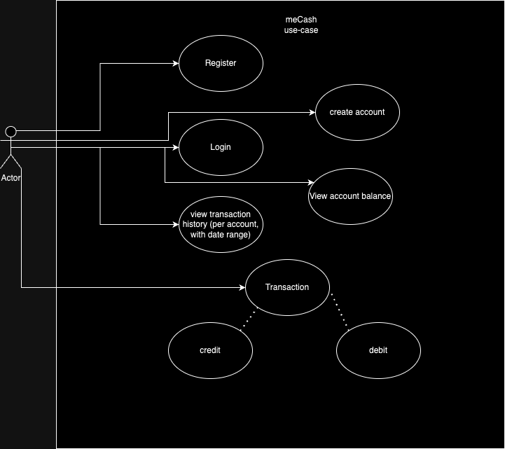
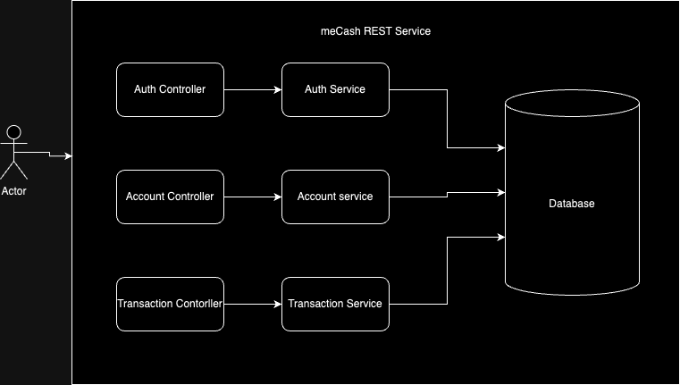

meCash Design
==================

# Table of Content

- [Functional Requirements](#functional-requirements)
- [Non Functional Requirements](#non-functional-requirements)
- [Use-case Diagrams](#use-case-diagram)
- [Capacity Estimation](#capacity-estimation)
- [Low level Design](#low-level-design)
  - [Authentication Service](#authentication-service)
  - [Account Service](#account-service)
  - [Transaction Service](#transaction-service)
- [High level Design](#high-level-design)
- [Database Design](#database-design)
- REST Endpoint
- Scalability

# Functional Requirements
- Customer Registration (Individual and Corporate)
- Customer Login (Individual and Corporate)
- Customer Account Creation (multi-currency)
- Deposit (multi-currency)
- Funds Transfer (multi-currency)
- View Account Balance (multi-currency)
- View Transaction History (multi-currency)

# Non-Functional Requirements
- Security:
  - Password Security:
    - password must contain at least one uppercase,lowercase, number, and a special character. Proposed regex will be ```/^(?=.*[0-9])(?=.*[a-z])(?=.*[A-Z])(?=.*\W)(?!.* ).{8,16}$/```
    - JWT token will be used for authentication and authorization of requests
- Audit Trail:
  - An audit trail of requests and responses 
  
- Availability: The system should always be available.
- Policies in Nigeria:
  - Individual Account:
    - An Individual account must have a valid BVN & NIN
  - Corporate Account:
    - A Corporate entity must have:
      - A valid registration number (Business Number or RC Number)
      - Corporate entities registered as a business(BN) will have at lease one signatory
      - Corporate entities registered as LLC(RC) must have at least two signatories
      - All signatories must have valid BVN and NIN

# Use-case Diagram


As seen in the image above the customer will be able to perform the following functions
- Register: The customer will register if they do not previously have a profile. Registration requires the  following:
  - BVN number
  - NIN number
  - Name (surname, firstname, middle name)
  - email
  - phone number (username)
  - DOB
  - password

- Login: Upon successful registration and login, the customer may log in with their username and password


- Create Account: The customer will log in with their username(phone number) and password 
  - A logged in customer may create one individual account per currency
  - A logged in customer may create one or many corporate accounts per currency. Each corporate account per currency must be created with one company or business registration number
  - Corporate entities(LLC - Limited Liability company)  must have at least two signatories
  - Individual or Corporate entities(Business Name) may have one or many signatories


- View account balance:
  - A logged-in user can view the balance of all the accounts he is a signatory of.


- View transaction:
  - A logged-in user can view a history of transactions on accounts he is a signatory of
  - A logged-in user must provide an account number as a query param
  - A logged-in user may provide a date range as a query param
  

- Transaction: A logged-in user may perform the following transactions
  - A transaction may either be of type `CREDIT` or `DEBIT`
  - A transaction may be one of the following categories:
    - Deposit: `CREDIT` till with cash transaction `DEBIT` the till account, `CREDIT` the customer account
    - Withdrawal: `DEBIT` customer account `CREDIT` the till account, `DEBIT` till with cash transaction
    - Transfer: `DEBIT` the initiator `CREDIT` the beneficiary

# Capacity Estimation
Assumption is 100 million users per month

``` 
Traffic per second: 100,000,000/30*24*60*60= 38.50 
Assumption: 30% traffic for new registration, 40% perform transactions, 30% view account balance and transaction history

TPS = 30+40 =70
Storage per second(100 KB/transaction)= 70*100 = 7000 KB/S = 7 MB/S
Storage required per year = 7*60*60*24*365 = 221 TB
```

# Low Level Design
## Authentication Service
### Responsibilities 
- Customer registration
- Customer Login
- Customer Token Validation
- Customer password management (out of scope)

### Components
- Auth Controller 
  - Handles HTTP requests related to authentication. 
  - Routes requests to appropriate service methods. 
- Auth Service 
  - Core business logic for authentication. 
  - Communicates with user repository and token manager. 
- User Repository 
  - Manages user data in the database. 
  - CRUD operations for user entities. 
- Token Provider 
  - Generates and validates JWT or other tokens. 
  - Manages token expiry and refresh tokens. 
- Authentication Manager 
  - Handles password hashing and verification. 
  - Manages password reset workflows. (Out of scope)
    
### Data Flow
#### User Registration:
- Client sends registration to Auth Controller. 
- Controller invokes Auth Service. 
- Service validates and hashes password, then stores user in User Repository. 
- Confirmation is sent back to the client.
#### User Login:
- Client sends login credentials to Auth Controller. 
- Controller invokes Auth Service. 
- Service validates credentials and generates token via Token Provider. 
- Token is sent back to the client.
### Considerations
- Security: Implement encryption, secure storage for passwords, and secure token generation. 
- Scalability: Ensure the service can handle a large number of authentication requests. 
- Resilience: Implement proper error handling and fallback mechanisms.

## Account Service
### Responsibilities 
- Account creation
- View account balance
### Components
- Account Controller 
  - Handles HTTP requests related to account management. 
  - Routes requests to appropriate service methods. 
- Account Service 
  - Core business logic for account creation. 
  - Communicates with account repository. 
- Account Repository 
  - Manages account data in the database. 
  - CRUD operations for account entities. 

### Data Flow
#### Create Account:
- Client sends account creation request to Account Controller. 
- Controller invokes Account Service. 
- Service stores account details in Account Repository. 
### Considerations
- Security: Secure sensitive account information. 
- Consistency: Ensure data consistency across different microservices. 
- Reliability: Ensure reliable verification processes and handle edge cases.
## Transaction Service
### Responsibilities
- Transaction Processing: Handle financial transactions.
- Transaction History: Store and retrieve transaction history.
- Balance Management: Update and retrieve account balances.
### Components
- Transaction Controller 
  - Handles HTTP requests related to transactions. 
  - Routes requests to appropriate service methods.
- Transaction Service 
  - Core business logic for transaction processing. 
  - Communicates with transaction repository and balance manager.
- Transaction Repository 
  - Manages transaction data in the database. 
  - CRUD operations for transaction entities.
- Balance Manager 
  - Handles balance updates and retrieval. 
  - Ensures consistency and accuracy of balances.
  
### Data Flow
#### Process Transaction:
- Client sends transaction request to Transaction Controller. 
- Controller invokes Transaction Service. 
- Service validates and processes the transaction, updates balances via Balance Manager, and stores transaction in Transaction Repository. 
- Confirmation is sent back to the client.
#### Retrieve Transaction History:
- Client sends request to Transaction Controller. 
- Controller invokes Transaction Service. 
- Service retrieves transaction history from Transaction Repository. 
- Transaction history is sent back to the client.
### Considerations
- Security: Secure transaction data and implement fraud detection. 
- Performance: Optimize for high-throughput and low-latency transaction processing. 
- Consistency: Ensure ACID properties for transactions to maintain data integrity.
#### Common Considerations Across Services
- Logging and Monitoring: Implement comprehensive logging and monitoring for all services. 
- Error Handling: Implement robust error handling and user-friendly error messages. 
- Testing: Ensure thorough unit, integration, and end-to-end testing. 
- Documentation: Maintain clear and comprehensive API documentation for all services.

# High-level Design


As seen in the diagram above, the user initiates an action , the action is routed to appropriate controller,
the controller in turn routes to appropriate service method which encapsulates the business 
logic and interaction with database before returning a result.

# Database Design

